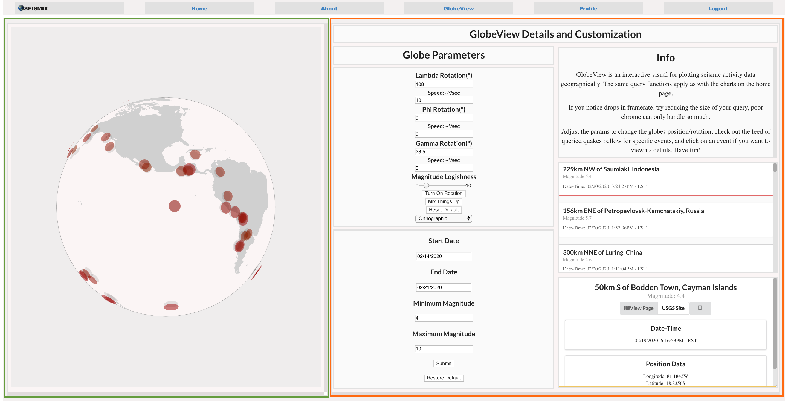

# SeisMix Frontend - README

## Settup: (NOTE: App was created with create-react-app, for default script info, see bottome of README)

To settup this app, after cloning run npm install to install all package dependencies. The main dependencies for this project are: 

- "d3": "^5.15.0"
- "react": "^16.12.0"
- "react-chartjs-2": "^2.9.0"
- "react-dom": "^16.12.0"
- "react-redux": "^7.1.3"
- "react-router-dom": "^5.1.2"
- "redux": "^4.0.5"
- "semantic-ui-react": "^0.88.2"
- "sweetalert2-react": "^0.8.3"
- "topojson-client": "^3.1.0"

After installing, running "yarn build" will create an optimized, minified version of the application that you can boot up with "serve -s build". This make take two to three minutes to complete. Alternatively, if you want to boot up the application in development mode, run "npm start". Either way your booted app should look something like this:

Some functions may not work if you aren't running your backend on localhost:3000. If your backend is running on a different port, go to the reducer file at "/reducers/reducer.js". At the top of the file their should be an initialState variable that handles all the load-up defaults for the application. At the very top is a "domain" key set to "localhost:3000". Change the value to whatever domain your backend is being hosted on.

This project also implements and expands on another repo of mine topojson-test, where I first build out and tested the settup of the Globe component with D3 and React.

## Components

This segment will be a brief rundown of the major components and some of their responsibilities. An extensive component tree for this app is displayed below:

This is a rough idea of the filenames and their relationships/positions along the tree. Since state in this app is being handled almost entirely by redux, this tree won't usually need to be referred too aside from determining what pages render which blocks.

The top level component App handles the state settup, timers and loading properties that the entire app needs to be aware of. One step below is the Routers for client side routing then the two main Components that actually display content to the page.

### NavBar

NavBar is the top div highlighted in red in the image above. It handles the links that change the URL for client-side routing, conditionally renders the Profile link if an authorized user is logged in, and also handles logout under the same conditions.

### Body

Body handles all the routing dependant on the current URL. Body and all of it's downstream components will remount as the links change, but Navbar and App will not. This is mostly important for keeping track of how App-level state will respond to different changes in the webpage.

Body renders different component containers based on the current URL, and they are detailed below:

#### Home

Renders a "Weekly" display of fetched quake data on the left (in green), with a downstream Chart component to handle the Chart.js implementations.

Renders a "GuideBox" With app details (in orange), a link to GlobeView and a downstream FetchForm component that is responsible for updating the current list of earthquake events. FetchForm is also rendered on the globe page, as detailed in the relationship chart

#### About

A relatively simple file of almost entirely hard-coded text. Provides details on my inspiration for the app, and a breakdown of key quake attributes for self-instruction.

#### GlobeView

One of the more involved components. Renders a Globe component (in green) that handles the D3 functions to translate map and quake features into the continents and quake circles.

Also renders a GlobeGuide component (in orange) that does four things: allows the user to update the current quakes just as on the front page, allows the user to update globe properties (rotation, projection type, etc.), provides a list of all currently rendered quakes with links, and provides a summary of details for the currently selected quake. 

#### Login

Renders a simple login page with username and password fields, and buttons to either create an account of login to existing. Alerts user with sweetalert if improper inputs occur.

#### Profile

Renders the users's profile page if logged in, else boots them to login page and forcably removes any invalid tokens. Profile page renders a CountriesMap component (green) that also marks down all of the events that a user has bookmarked with hover-over details and links to their show pages.

Also renders a User's profile card with details, and two lists, one of their bookmarks and one of their comments (orange). Both support links to the events they refer too. 

Both the Countries Map and the Comment List components are used by the Quake Show page as well, indicated on the relationship tree.

#### QuakeShow

Lastly, the Quake show page renders a CountriesMap with the specific event pinned and a CommentList containing all the insights for this particular event (green).

Also renders a list of stats, details and advisories generated conditionally based on the events specs (orange).

Documentation on the specifics of implementation can be found in the corresponding component files. Have fun!

# Default Scripts included with Create-React-App

This project was bootstrapped with [Create React App](https://github.com/facebook/create-react-app).

## Available Scripts

In the project directory, you can run:

### `yarn start`

Runs the app in the development mode. 
Open [http://localhost:3000](http://localhost:3000) to view it in the browser.

The page will reload if you make edits. 
You will also see any lint errors in the console.

### `yarn test`

Launches the test runner in the interactive watch mode. 
See the section about [running tests](https://facebook.github.io/create-react-app/docs/running-tests) for more information.

### `yarn build`

Builds the app for production to the `build` folder. 
It correctly bundles React in production mode and optimizes the build for the best performance.

The build is minified and the filenames include the hashes. 
Your app is ready to be deployed!

See the section about [deployment](https://facebook.github.io/create-react-app/docs/deployment) for more information.

### `yarn eject`

**Note: this is a one-way operation. Once you `eject`, you can’t go back!**

If you aren’t satisfied with the build tool and configuration choices, you can `eject` at any time. This command will remove the single build dependency from your project.

Instead, it will copy all the configuration files and the transitive dependencies (Webpack, Babel, ESLint, etc) right into your project so you have full control over them. All of the commands except `eject` will still work, but they will point to the copied scripts so you can tweak them. At this point you’re on your own.

You don’t have to ever use `eject`. The curated feature set is suitable for small and middle deployments, and you shouldn’t feel obligated to use this feature. However we understand that this tool wouldn’t be useful if you couldn’t customize it when you are ready for it.

## Learn More

You can learn more in the [Create React App documentation](https://facebook.github.io/create-react-app/docs/getting-started).

To learn React, check out the [React documentation](https://reactjs.org/).

### Code Splitting

This section has moved here: https://facebook.github.io/create-react-app/docs/code-splitting

### Analyzing the Bundle Size

This section has moved here: https://facebook.github.io/create-react-app/docs/analyzing-the-bundle-size

### Making a Progressive Web App

This section has moved here: https://facebook.github.io/create-react-app/docs/making-a-progressive-web-app

### Advanced Configuration

This section has moved here: https://facebook.github.io/create-react-app/docs/advanced-configuration

### Deployment

This section has moved here: https://facebook.github.io/create-react-app/docs/deployment

### `yarn build` fails to minify

This section has moved here: https://facebook.github.io/create-react-app/docs/troubleshooting#npm-run-build-fails-to-minify
